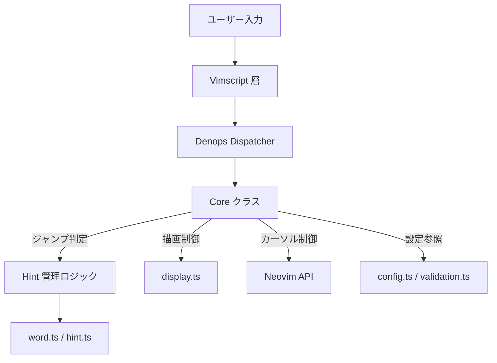
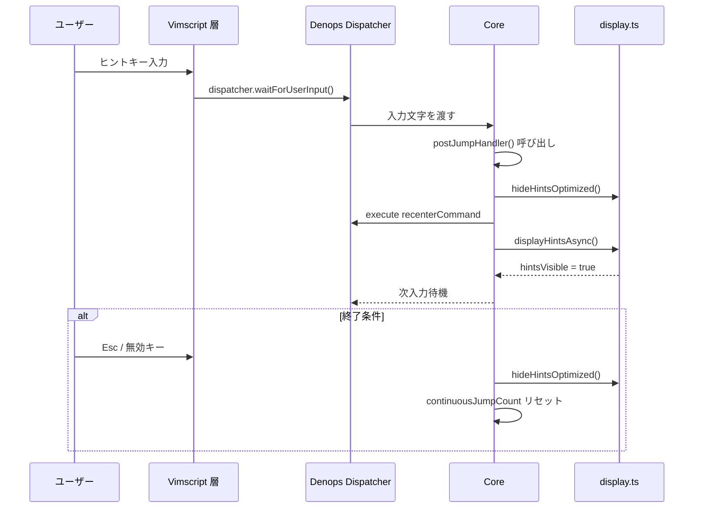
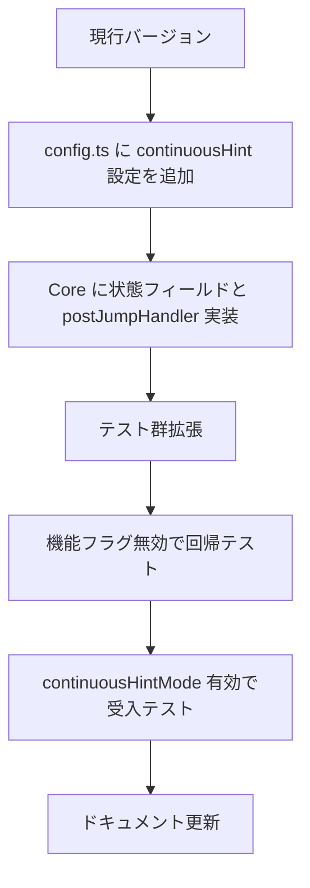

# Design Document

## Overview
本機能は `continuousHintMode` を中心とした連続ヒントループを実装し、ヒントジャンプ直後にカーソルを再センタリングした上でヒントを自動再描画することで、Neovim 上での継続的な単語移動体験を滑らかにする。対象ユーザーはキーボード操作を多用し日本語混在テキストを編集する利用者であり、既存の単発ヒント操作を拡張した形で連続性と視認性を向上させる。

### Goals
- `continuousHintMode` 有効時に、ヒント入力→ジャンプ→再センタリング→再描画のループを自動化する。
- 再センタリングコマンドおよび最大ジャンプ回数を設定値として受け取り、柔軟に制御できるようにする。
- ループ終了条件と安全装置を明示的に実装し、既存挙動との後方互換性を保つ。

### Non-Goals
- Vimscript 側の新たなキー割り当てや UI 表示の変更は対象外とする。
- 既存のヒント生成アルゴリズム（`hint.ts`, `word.ts`）のロジック最適化は行わない。
- Deno 実行時設定やビルドパイプラインに対する変更は行わない。

## Architecture

### Existing Architecture Analysis
- Vimscript 層（`plugin/hellshake-yano.vim`, `autoload/hellshake_yano/*.vim`）がユーザー設定を集約し、Denops 経由で TypeScript 側の Core クラスへ委譲する構造をとっている。
- TypeScript 側は `Core` クラスがエントリポイントであり、ヒント生成 (`hint.ts`)、単語検出 (`word.ts`)、表示制御 (`display.ts`) を統括し、`performance.ts` が計測／キャッシュ管理を担う。
- `config.ts` と `validation.ts` に設定検証が集約されており、新規設定はここを介して適用される必要がある。
- 既存の `hideHintsOptimized`・`displayHintsAsync`・`waitForUserInput` がヒント表示サイクルの中核であるため、連続ループもこれらを再利用する。

### High-Level Architecture


### Technology Alignment
- 既存スタック（Vimscript + Denops + TypeScript）を踏襲し、新しい外部依存を追加しない。
- 再センタリングは既存の Ex コマンド実行（`denops.cmd(config.recenterCommand)`）を利用するため新規 API 導入は不要。
- 内部状態管理は `Core` クラスのプライベートフィールドを拡張することで実現し、キャッシュ (`LRUCache`) などの現行仕組みを温存する。

### Key Design Decisions
- **Decision:** 連続ジャンプ状態を `Core` インスタンスに保持する。
  - **Context:** ループ開始／終了や安全カウンターが複数メソッドに跨るため一貫した状態管理が必要。
  - **Alternatives:** (1) グローバル変数として `pluginState` に追加、(2) Vimscript に状態を退避。
  - **Selected Approach:** `Core` のプライベートフィールド（`continuousJumpCount`, `lastJumpBufnr`, `continuousModeActive`）を新設し、ジャンプ処理後の共通ハンドラで更新する。
  - **Rationale:** Core が dispatcher からの入力を一手に扱っており、バッファ境界チェックやカウンターリセットを集約しやすい。
  - **Trade-offs:** Core.ts の責務が増えるが、関連ロジックが集中することでテストしやすさを確保できる。
- **Decision:** ジャンプ後処理を `postJumpHandler` メソッドに抽象化する。
  - **Context:** 単一文字ジャンプ、タイムアウト、自動選択など複数箇所で同等の後処理が必要。
  - **Alternatives:** (1) 既存各所に逐次追記、(2) display.ts 側に委譲。
  - **Selected Approach:** Core 内部に共通メソッドを追加し、各ジャンプ分岐から呼び出す。
  - **Rationale:** 状態更新・安全装置・再センタリングを一括で行え、重複を排除できる。
  - **Trade-offs:** メソッド抽出に伴い既存コードの読み替えが必要だが、再利用性が上がる。
- **Decision:** `recenterCommand` を直接実行する専用ヘルパを導入する。
  - **Context:** コマンド失敗時の例外処理とデフォルト `"normal! zz"` の適用を保証する必要がある。
  - **Alternatives:** (1) 既存の display モジュールに移譲、(2) Vimscript 側で実行。
  - **Selected Approach:** Core 内で `await denops.cmd(config.recenterCommand)` をラップした `executeRecenter` を実装し、例外はログ出力の上でループ停止にフォールバック。
  - **Rationale:** 連続ループの制御フロー中にあるため Core に留める方が分かりやすい。
  - **Trade-offs:** Core 内で Denops 呼び出しが増えるが、副作用範囲は限定的。

## System Flows


## Requirements Traceability
| Requirement | 要約 | 主担当コンポーネント | 関連メソッド | フロー参照 |
|-------------|------|----------------------|---------------|-------------|
| R1.1-1.4 | 連続ループ開始と継続 | Core (waitForUserInput, postJumpHandler) | `beginContinuousMode`, `postJumpHandler` | System Flow 全体 |
| R2.1-2.4 | 再センタリングと再描画 | Core, display.ts | `executeRecenter`, `displayHintsAsync` | System Flow メインシーケンス |
| R3.1-3.4 | 終了条件とセーフティ | Core | `resetContinuousMode`, `checkJumpCap` | System Flow 終了分岐 |
| R4.1-4.4 | 設定検証と互換性 | config.ts, validation.ts, tests | `validateConfig`, 既存テスト群 | — |

## Components and Interfaces

### Core Layer

#### Core Continuous Hint Controller (`core.ts` 内部拡張)
**Responsibility & Boundaries**
- 連続ヒントモードの状態管理（有効化、カウンター、バッファ境界）。
- ジャンプ後処理（非表示→再センタリング→再描画）を一元化。
- ループ終了条件（無効キー、Esc、上限到達、バッファ移動）の検知とハンドリング。

**Dependencies**
- **Inbound:** Denops dispatcher (`main.ts`) からの `waitForUserInput` 呼び出し。
- **Outbound:** `display.ts` の `hideHintsOptimized`, `displayHintsAsync`; `denops.cmd` による Neovim API 実行。
- **External:** 設定値は `Config`（`config.ts`）を参照。

**Contract Definition**
```typescript
interface ContinuousHintController {
  beginContinuousMode(bufnr: number): void;
  postJumpHandler(denops: Denops, jumpResult: JumpResult): Promise<void>;
  resetContinuousMode(): void;
  checkJumpCap(): boolean;
}
```
- **Preconditions:** `continuousHintMode` が有効であること / ジャンプ結果が有効。
- **Postconditions:** 再センタリング・再描画が完了し、`continuousJumpCount` が更新される。
- **Invariants:** `continuousJumpCount` は 0 以上 `maxContinuousJumps` 以下。

### Display Layer

#### Hint Display Orchestrator (`display.ts`)
**Responsibility & Boundaries**
- ヒントの描画・非表示制御を提供し、Core のループから呼び出される。
- 既存キャッシュの再利用を通じて redraw コストを抑制。

**Dependencies**
- **Inbound:** Core からの非同期呼び出し。
- **Outbound:** Neovim extmarks / matchadd を通じた UI 更新。

**Contract Definition**
- 既存 API (`displayHintsAsync`, `hideHintsOptimized`, `highlightCandidateHintsAsync`) を連続モードでもそのまま使用。
- 追加で `displayHintsOptimized` を再利用する場合、連続モード向けフラグを引数に拡張する余地を残す（本設計では既存シグネチャを保持）。

### Configuration Layer

#### Continuous Hint Config Validator (`config.ts`, `validation.ts`)
**Responsibility & Boundaries**
- `continuousHintMode` を boolean として検証。
- `recenterCommand` の非空文字列チェック。
- `maxContinuousJumps` の正整数チェック。

**Dependencies**
- **Inbound:** Vimscript 設定ロード、テストコード。
- **Outbound:** エラーログ (`echom` 経由) とデフォルト値の適用。

**Contract Definition**
```typescript
type ContinuousHintSettings = Pick<Config,
  "continuousHintMode" | "recenterCommand" | "maxContinuousJumps"
>;
```
- **Preconditions:** ユーザー設定が `Partial<Config>` として渡される。
- **Postconditions:** 検証済み設定が Core へ供給される。

### Vimscript Integration

#### Autoload Dispatcher (`autoload/hellshake_yano/hint.vim` など)
**Responsibility & Boundaries**
- 連続モード用の追加 API 呼び出しは不要。既存の `hellshake_yano#hint#show()` などがそのまま Core へ委譲する。
- デフォルト設定 (`plugin/hellshake-yano.vim`) に `g:hellshake_yano` フィールドとして新オプションが滞りなく渡ることを確認する。

**Dependencies**
- **Inbound:** ユーザーによる `let g:hellshake_yano = {...}`。
- **Outbound:** Denops `dispatch` 呼び出し。

## Error Handling

### Error Strategy
- 再センタリングコマンド実行時に例外が発生した場合はログを残しつつ連続モードを終了させ、ユーザー操作へ制御を返す。
- `displayHintsAsync` が失敗した場合も同様に連続モードを終了してキャッシュをクリアし、既存のエラー処理と整合させる。

### Error Categories and Responses
- **User Errors:** 無効キー入力（Requirement 3.1）が発生した場合はヒントを閉じ、カウンターをリセットする。
- **System Errors:** Denops 呼び出し失敗や Neovim API エラー時は警告ログを出力し、連続モードを強制停止。
- **Business Logic Errors:** `maxContinuousJumps` を超えた場合はメッセージ表示し、ユーザーのさらなる操作に備えて状態を初期化。

### Monitoring
- 既存の `performance.ts` 計測で `showHints` と `hideHints` のメトリクスが記録されるため、連続モードに入ったタイミングでカウンター状態をデバッグログに残すオプション（`debugMode` 有効時）を追加する。

## Testing Strategy

### Unit Tests
- Core の `postJumpHandler` が無効キー入力時にカウンターをリセットすることを検証するテストを追加。
- `checkJumpCap` が `maxContinuousJumps` の値に従って強制終了をトリガーするか検証。
- `executeRecenter` ヘルパが `recenterCommand` を正しく実行し、例外時に fallback を発動するかモックで確認。

### Integration Tests
- `tests/core_test.ts` に連続モード有効化後のジャンプフロー（ヒント再描画まで）を確認するケースを追加。
- `tests/key_switching_test.ts` に無効キー入力でのループ終了シナリオを追加。
- `tests/integration_hint_groups_test.ts` など既存のヒント周辺テストで連続モード無効時に既存挙動が変わらないことを確認する。

### E2E / Vimscript Tests
- `tests/motion_module_test.vim` に `g:hellshake_yano.continuousHintMode = v:true` のセッションを加え、複数ジャンプが継続することを確認する。

### Performance
- `tests/performance_benchmark_test.ts` で連続モード有効時の `showHints` 計測が急激に悪化しないことを確認する。

## Performance & Scalability
- 連続ループは既存キャッシュを再利用するためヒント再生成のコストは最小限。`continuousJumpCount` のしきい値で無限ループを防ぐ。
- `displayHintsAsync` 呼び出し間で同一バッファの extmark 更新のみ行われるため、追加負荷は限定的。必要に応じて `HIGHLIGHT_BATCH_SIZE` を設定で調整可能。

## Migration Strategy

- 既存ユーザーはデフォルト `continuousHintMode = false` のまま動作が変わらないため段階的リリースが可能。
- 不具合発生時は設定で即座に機能を無効化できる。
