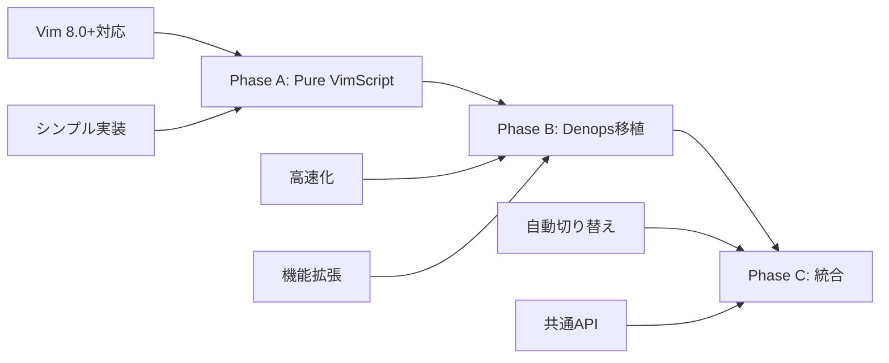
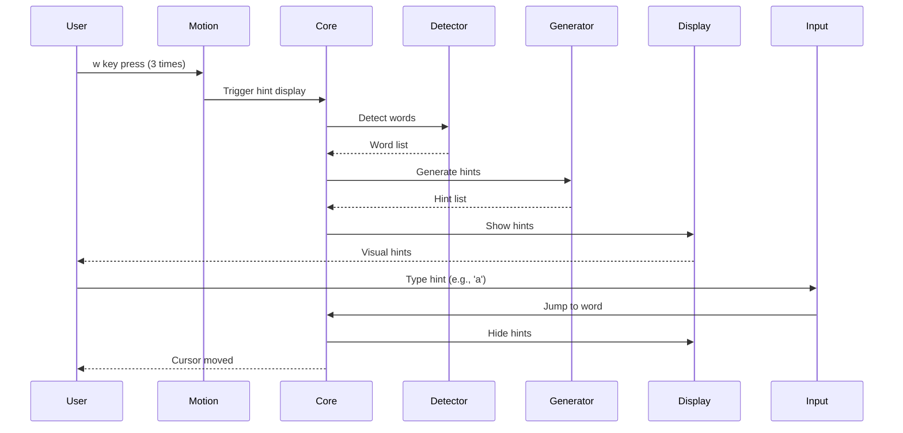

# hellshake-yano.vim Architecture Documentation

## 目次
1. [現状分析](#現状分析)
2. [技術調査結果](#技術調査結果)
3. [アーキテクチャ設計](#アーキテクチャ設計)
4. [実装計画](#実装計画)
5. [技術仕様](#技術仕様)
6. [テスト計画](#テスト計画)

---

## 現状分析

### 既存実装の構造（Neovim + Denops）

現在のhellshake-yano.vimは、Neovimに特化した実装となっており、Denops（Deno + TypeScript）に強く依存しています。

```
現在の構造:
plugin/hellshake-yano.vim           # VimScriptエントリーポイント
├── autoload/hellshake_yano/*.vim   # VimScript補助機能
└── denops/hellshake-yano/*.ts      # TypeScriptメイン実装
```

**主要な問題点:**
- Vimでは動作しない（Neovim専用機能を使用）
- Denopsが必須（TypeScript実装に依存）
- 複雑な依存関係による保守の困難さ

### vim-searchxの実装パターン分析

vim-searchxは、Pure VimScriptでhit-a-hint機能を実現している優れた実装例です。

**主要な実装パターン:**

| パターン | 実装方法 | 利点 |
|----------|----------|------|
| **画面内検出** | `line('w0')` / `line('w$')` | 高速処理 |
| **マーカー表示（Neovim）** | `nvim_buf_set_extmark()` with virtual text | オーバーレイ表示 |
| **マーカー表示（Vim）** | `prop_add()` + `popup_create()` | テキストにアンカー |
| **非同期処理** | `timer_start()` + クロージャー | ノンブロッキング |
| **入力処理** | `getchar()` in timer loop | リアルタイム反応 |

---

## 技術調査結果

### 1. Pure VimScriptでのhit-a-hint実装

#### 単語検出アルゴリズム
```vim
function! s:detect_words() abort
  let l:words = []
  let l:lnum_s = line('w0')  " 画面上端
  let l:lnum_e = line('w$')  " 画面下端

  for l:lnum in range(l:lnum_s, l:lnum_e)
    let l:line = getline(l:lnum)
    let l:col = 0
    while l:col < len(l:line)
      " matchstrpos()で効率的にマッチ位置を取得
      let l:match = matchstrpos(l:line, '\w\+', l:col)
      if l:match[0] == ''
        break
      endif
      call add(l:words, {
        \ 'text': l:match[0],
        \ 'lnum': l:lnum,
        \ 'col': l:match[1] + 1,
        \ 'end_col': l:match[2]
      \ })
      let l:col = l:match[2]
    endwhile
  endfor
  return l:words
endfunction
```

#### ヒント生成戦略
```vim
" 効率的なヒント文字の割り当て
function! s:generate_hints(count) abort
  let l:chars = ['a', 's', 'd', 'f', 'j', 'k', 'l']
  let l:hints = []

  " Phase 1: 単一文字（最大7個）
  for l:i in range(min([a:count, len(l:chars)]))
    call add(l:hints, l:chars[l:i])
  endfor

  " Phase 2: 2文字組み合わせ（7個以降）
  if a:count > len(l:chars)
    for l:i in range(a:count - len(l:chars))
      let l:idx = l:i + len(l:chars)
      let l:first = l:chars[l:idx % len(l:chars)]
      let l:second = l:chars[l:idx / len(l:chars) % len(l:chars)]
      call add(l:hints, l:first . l:second)
    endfor
  endif

  return l:hints
endfunction
```

### 2. 表示技術（popup/textprop）

#### Vim 8.0+ での実装
```vim
" Text Propertyでアンカーポイントを作成
call prop_type_add('hint_anchor', {
  \ 'highlight': 'None'
\ })

" Popupでヒントを表示
function! s:show_hint(word, hint) abort
  " アンカーとなるText Propertyを追加
  call prop_add(a:word.lnum, a:word.col, {
    \ 'type': 'hint_anchor',
    \ 'id': a:word.id,
    \ 'length': 1
  \ })

  " Text Propertyにアンカーされたポップアップ
  let l:popup_id = popup_create(a:hint, {
    \ 'line': -1,
    \ 'col': -1,
    \ 'textprop': 'hint_anchor',
    \ 'textpropid': a:word.id,
    \ 'width': strlen(a:hint),
    \ 'height': 1,
    \ 'highlight': 'HintMarker',
    \ 'zindex': 1000,
    \ 'wrap': 0
  \ })

  return l:popup_id
endfunction
```

#### Neovim での最適化（将来の拡張用）
```vim
if has('nvim')
  " Virtual Textを使用した高速表示
  let s:ns = nvim_create_namespace('hint')
  call nvim_buf_set_extmark(0, s:ns, a:word.lnum - 1, a:word.col - 1, {
    \ 'virt_text': [[a:hint, 'HintMarker']],
    \ 'virt_text_pos': 'overlay',
    \ 'priority': 1000
  \ })
endif
```

### 3. 非同期入力処理

```vim
" タイマーベースの非同期入力処理
function! s:wait_for_input(hint_map) abort
  let l:input_buffer = ''

  function! s:check_input(timer) abort closure
    " 非ブロッキングで入力をチェック
    if getchar(1) != 0
      let l:char = nr2char(getchar())
      let l:input_buffer .= l:char

      " 完全一致チェック
      if has_key(a:hint_map, l:input_buffer)
        call timer_stop(a:timer)
        call s:jump_to_word(a:hint_map[l:input_buffer])
        return
      endif

      " 部分一致チェック
      let l:has_partial = v:false
      for l:key in keys(a:hint_map)
        if stridx(l:key, l:input_buffer) == 0
          let l:has_partial = v:true
          " 部分一致のハイライト更新
          call s:highlight_partial_matches(l:input_buffer)
          break
        endif
      endfor

      if !l:has_partial
        " マッチなし→キャンセル
        call timer_stop(a:timer)
        call s:hide_all_hints()
      endif
    endif
  endfunction

  " 10msごとに入力をチェック
  return timer_start(10, function('s:check_input'), {'repeat': -1})
endfunction
```

---

## アーキテクチャ設計

### 3段階の実装戦略



### Phase A: Pure VimScript実装

#### ファイル構造
```
plugin/
└── hellshake-yano-vim.vim              # エントリーポイント

autoload/hellshake_yano_vim/
├── core.vim                             # 状態管理・初期化
├── word_detector.vim                    # 単語検出
├── hint_generator.vim                   # ヒント生成
├── display.vim                          # 表示制御
├── input.vim                            # 入力処理
├── jump.vim                             # ジャンプ機能
├── motion.vim                           # モーション検出
├── config.vim                           # 設定管理
└── utils.vim                            # ユーティリティ
```

#### モジュール間の依存関係
```
core.vim
├── config.vim
├── word_detector.vim
│   └── utils.vim
├── hint_generator.vim
├── display.vim
│   └── utils.vim
├── input.vim
│   └── jump.vim
└── motion.vim
```

### Phase B: Denops移植版

#### ファイル構造
```
denops/hellshake-yano-vim/
├── main.ts                              # エントリーポイント
├── core.ts                              # コア機能
├── wordDetector.ts                      # 単語検出（最適化）
├── hintGenerator.ts                     # ヒント生成
├── display.ts                           # 表示制御
├── input.ts                             # 入力処理
├── config.ts                            # 設定管理
└── types.ts                             # 型定義
```

#### 移植方針
1. VimScript版の機能を1対1で移植
2. TypeScriptの型システムで堅牢性向上
3. Denopsの非同期APIで高速化
4. 既存のhellshake-yano実装の良い部分を取り入れる

### Phase C: 統合アーキテクチャ

```vim
" plugin/hellshake-yano.vim での実装選択
function! s:select_implementation() abort
  if has('nvim') && exists('g:loaded_denops')
    " 既存のNeovim + Denops実装
    return 'neovim-denops'
  elseif exists('g:loaded_denops')
    " 新しいDenops移植版
    return 'vim-denops'
  else
    " Pure VimScript実装
    return 'vim-pure'
  endif
endfunction
```

---

## 実装計画

### タイムライン

| Phase | 期間 | 主要マイルストーン |
|-------|------|--------------------|
| **Phase A-1: MVP** | 1日 | 固定ヒント表示・基本ジャンプ |
| **Phase A-2: 単語検出** | 2日 | 画面内単語の自動検出 |
| **Phase A-3: 複数文字** | 2日 | aa, as, ad...の対応 |
| **Phase A-4: モーション** | 3日 | w/b/e連打でヒント表示 |
| **Phase A-5: 高度な機能** | 1週間 | 日本語、キャッシュ、カスタマイズ |
| **Phase B: Denops移植** | 1週間 | TypeScript実装、高速化 |
| **Phase C: 統合** | 1週間 | 3実装の統合、リファクタリング |

### 各フェーズの詳細

#### Phase A-1: MVP（最小実装）
```vim
" 目標: 3つの固定位置にヒントを表示し、キー入力でジャンプ
" テストコマンド
:HellshakeYanoVimTest

" 実装内容
- plugin/hellshake-yano-vim.vim （エントリーポイント）
- autoload/hellshake_yano_vim/core.vim （基本機能）
- autoload/hellshake_yano_vim/display.vim （popup表示）
- 固定座標へのヒント表示
- 単一キー入力でのジャンプ
```

#### Phase A-2: 単語検出
```vim
" 目標: 画面内の全単語を検出してヒントを割り当て
" 実装内容
- autoload/hellshake_yano_vim/word_detector.vim
- 正規表現 \w\+ での単語検出
- 画面内限定（line('w0')～line('w$')）
- 単語とヒントの関連付け
```

#### Phase A-3: 複数文字ヒント
```vim
" 目標: 7個以上の単語に対応
" 実装内容
- autoload/hellshake_yano_vim/hint_generator.vim の拡張
- aa, as, ad, af... の生成アルゴリズム
- autoload/hellshake_yano_vim/input.vim の複数文字対応
- 部分マッチのハイライト
```

#### Phase A-4: モーション連打検出
```vim
" 目標: w/b/eを3回連打でヒント表示
" 実装内容
- autoload/hellshake_yano_vim/motion.vim
- モーションコマンドのフック
- 連打カウントとタイムアウト
- 自動ヒント表示トリガー
```

#### Phase A-5: 高度な機能
```vim
" 目標: 実用的な完成度
" 実装内容
- 日本語単語の検出（基本的な境界検出）
- 単語検出結果のキャッシュ
- ビジュアルモード対応
- カスタマイズ可能な設定
- ハイライトグループの設定
```

---

## 技術仕様

### データ構造

#### Word（単語）
```vim
let l:word = {
  \ 'id': 1,
  \ 'text': 'hello',
  \ 'lnum': 10,
  \ 'col': 5,
  \ 'end_col': 10,
  \ 'hint': 'a',
  \ 'popup_id': 1234
\ }
```

#### State（状態管理）
```vim
let s:state = {
  \ 'enabled': v:true,
  \ 'hints_visible': v:false,
  \ 'words': [],
  \ 'hints': [],
  \ 'hint_map': {},
  \ 'popup_ids': [],
  \ 'motion_count': {},
  \ 'last_motion_time': {},
  \ 'input_timer': 0,
  \ 'config': {}
\ }
```

#### Config（設定）
```vim
let g:hellshake_yano_vim = {
  \ 'enabled': v:true,
  \ 'hint_chars': 'asdfjkl',
  \ 'min_word_length': 2,
  \ 'motion_threshold': 3,
  \ 'motion_timeout': 2000,
  \ 'highlight_hint': 'DiffAdd',
  \ 'highlight_current': 'DiffText',
  \ 'exclude_pattern': '',
  \ 'use_cache': v:true,
  \ 'debug': v:false
\ }
```

### API設計

#### Public Functions
```vim
" プラグインの有効/無効
hellshake_yano_vim#enable()
hellshake_yano_vim#disable()
hellshake_yano_vim#toggle()

" ヒント表示
hellshake_yano_vim#show()
hellshake_yano_vim#hide()

" 設定
hellshake_yano_vim#config#set(key, value)
hellshake_yano_vim#config#get(key)

" デバッグ
hellshake_yano_vim#debug#info()
hellshake_yano_vim#debug#reset()
```

#### Events
```vim
" ユーザーイベント
doautocmd User HellshakeYanoVimEnter      " ヒント表示開始
doautocmd User HellshakeYanoVimLeave      " ヒント表示終了
doautocmd User HellshakeYanoVimJumped     " ジャンプ完了
doautocmd User HellshakeYanoVimCanceled   " キャンセル
```

### イベントフロー



---

## テスト計画

### Phase A: VimScript実装のテスト

#### 単体テスト
```vim
" tests/test_word_detector.vim
function! Test_word_detection()
  " テストバッファを準備
  new
  call setline(1, ['hello world vim script'])

  " 単語検出
  let l:words = hellshake_yano_vim#word_detector#detect_visible()

  " アサーション
  call assert_equal(4, len(l:words))
  call assert_equal('hello', l:words[0].text)
  call assert_equal(1, l:words[0].lnum)
  call assert_equal(1, l:words[0].col)

  bdelete!
endfunction
```

#### 統合テスト
```vim
" tests/test_integration.vim
function! Test_full_flow()
  " セットアップ
  new
  call setline(1, ['test text for jumping'])

  " ヒント表示
  call hellshake_yano_vim#show()
  call assert_true(s:state.hints_visible)

  " ジャンプシミュレーション
  " （getchar()のモックが必要）

  " クリーンアップ
  call hellshake_yano_vim#hide()
  bdelete!
endfunction
```

### Phase B: Denops実装のテスト

```typescript
// tests/wordDetector.test.ts
import { assertEquals } from "https://deno.land/std/testing/asserts.ts";
import { detectWords } from "../denops/hellshake-yano-vim/wordDetector.ts";

Deno.test("detect words in line", () => {
  const line = "hello world typescript";
  const words = detectWords(line, 1);

  assertEquals(words.length, 3);
  assertEquals(words[0].text, "hello");
  assertEquals(words[0].col, 1);
});
```

### Phase C: 統合テスト

#### 環境別テストマトリクス

| 環境 | VimScript版 | Denops版 | Neovim版 |
|------|------------|----------|----------|
| Vim 8.0 | ✓ | - | - |
| Vim 8.2 | ✓ | - | - |
| Vim 8.2 + Denops | ✓ | ✓ | - |
| Neovim 0.5 | ✓ | - | - |
| Neovim 0.8 + Denops | ✓ | ✓ | ✓ |

### パフォーマンステスト

```vim
function! Benchmark_word_detection()
  " 1000行のテストデータ
  new
  for i in range(1000)
    call append('$', 'word' . i . ' test line with multiple words')
  endfor

  " 計測
  let l:start = reltime()
  let l:words = hellshake_yano_vim#word_detector#detect_visible()
  let l:elapsed = reltimefloat(reltime(l:start)) * 1000

  echo printf("Detection time: %.2f ms for %d words", l:elapsed, len(l:words))

  bdelete!
endfunction
```

### 自動テスト実行

```bash
# Vimでのテスト
vim -N -u NONE -c "source tests/run_all.vim" -c "qa!"

# Denoでのテスト
deno test --allow-all

# CI/CD統合
# .github/workflows/test.yml で自動実行
```

---

## まとめ

このアーキテクチャにより、以下を実現します：

1. **段階的な実装** - VimScriptから始めて徐々に高度化
2. **広い互換性** - Vim 8.0+からNeovim + Denopsまで対応
3. **保守性** - モジュール化された設計で保守が容易
4. **パフォーマンス** - 環境に応じた最適な実装を選択
5. **拡張性** - 将来の機能追加が容易な設計

最初はシンプルなVimScript実装から始め、動作確認しながら段階的に機能を追加し、最終的にDenopsで高速化・高機能化を実現します。